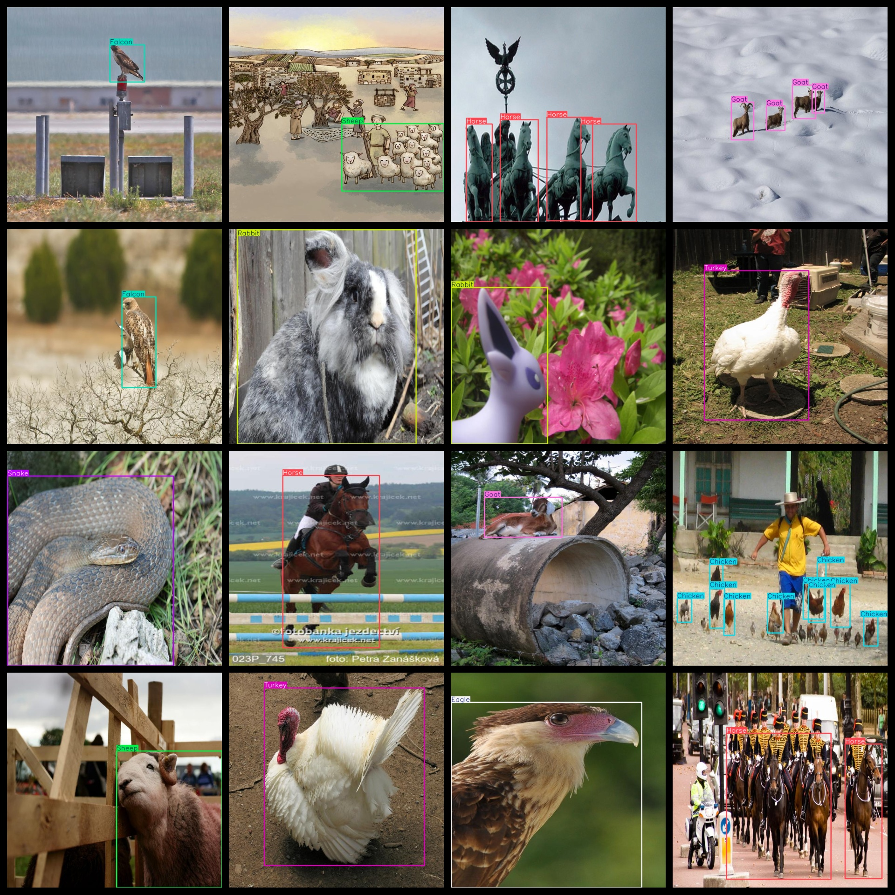
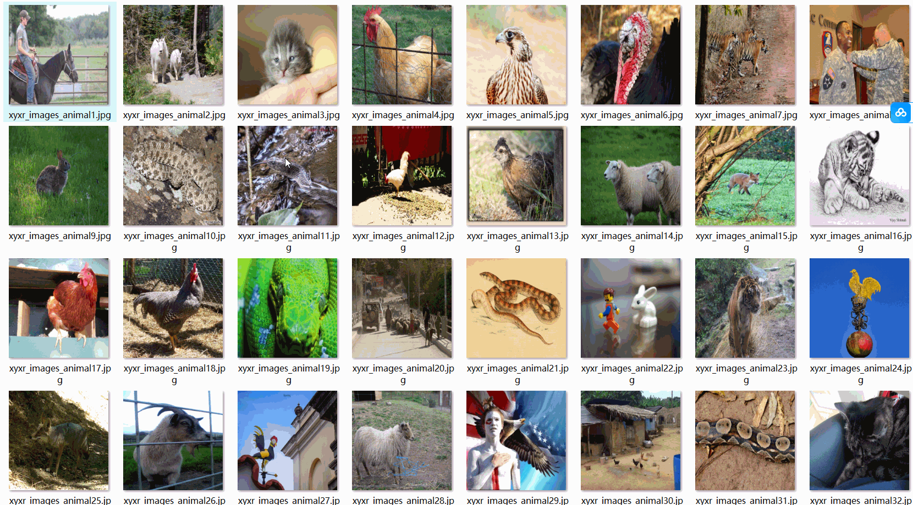

# 12 Types Animal Dataset: 5527 Images in VOC+YOLO Format

The 12 types animal dataset consists of 5527 images. The dataset contains only a very small proportion of non-realistic animal images, such as hand-drawn, printed, or sculpted animals, which is extremely rare.

The dataset is formatted in both VOC and YOLO formats. It includes three folders within the zip file, each storing different types of files: images, xml, and txt.

In the JPEGImages folder, there are a total of 5527 jpg images.

The Annotations folder contains a total of 5527 xml files for annotation.

The labels folder has a total of 5527 txt files for labels.

There are a total of 12 label categories: ["Cat", "Chicken", "Eagle", "Falcon", "Fox", "Goat", "Horse", "Rabbit", "Sheep", "Snake", "Tiger", "Turkey"].

These label names are also included in the labels folder: [“Cat”, “Chicken”, “Eagle”, “Falcon”, “Fox”, “Sheep”, “Horse”, “Rabbit”, “Sheep”, “Snake”, “Tiger”, “Turkey”].

The number of boxes (yolo format) for each category varies. Please refer to the classes.txt file in the labels folder for the correct order of box numbers for each category.

Here are the box numbers for each category:

Cat: 595

Chicken: 1116

Eagle: 297

Falcon: 590

Fox: 565

Goat: 804

Horse: 949

Rabbit: 654

Sheep: 1466

Snake: 591

Tiger: 599

Turkey: 734

Total box count: 8960

The image resolution is clear.

The images are not enhanced.

The shape of the labels is a rectangular box used for object detection recognition.

Special Note: This dataset does not guarantee the accuracy or precision of any trained models or weight files. The dataset provides accurate and reasonable annotations only.

The annotation and image details are as follows:
## Images

---

Here is a pay link on Stripe (https://buy.stripe.com/3cs8yP7sY87d0vu9AB). Please contact me lonlonago@foxmail.com after funding $89, and I will send you a complete data files, thank you!

